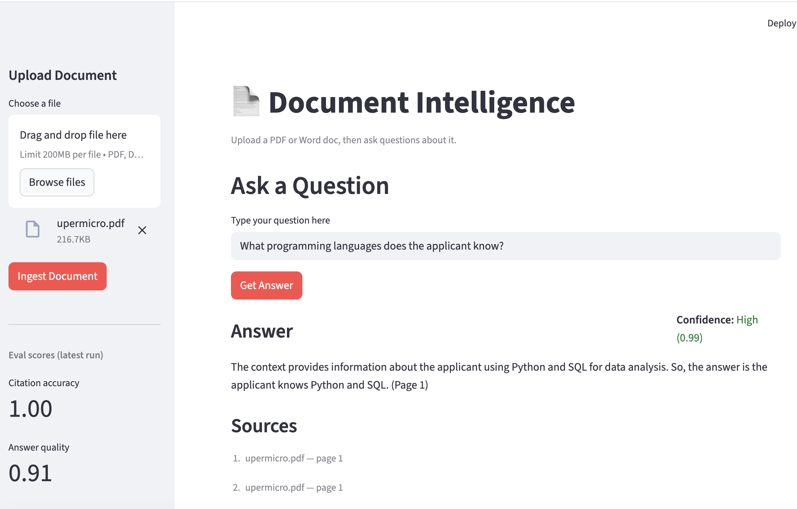
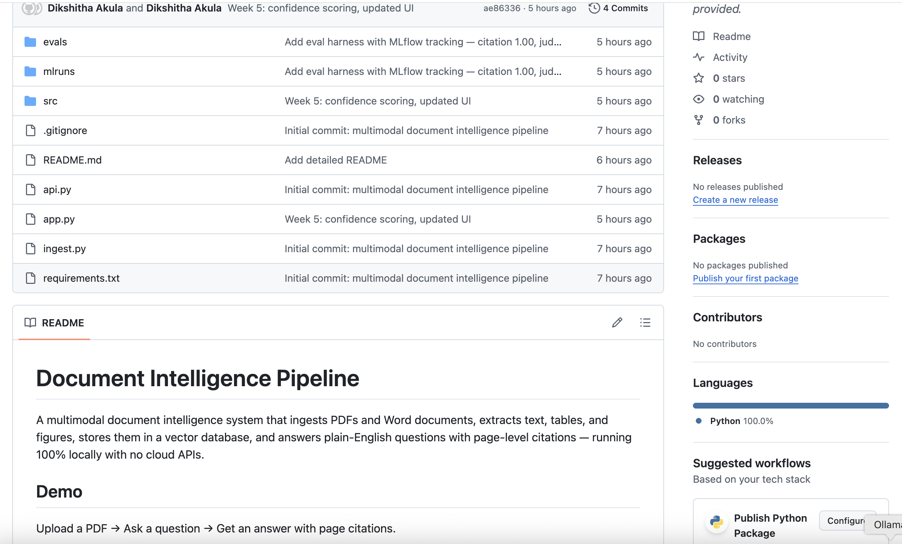
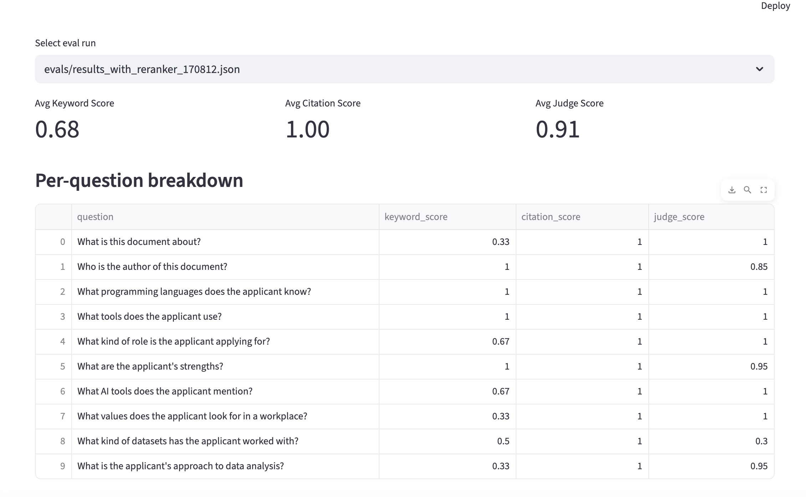
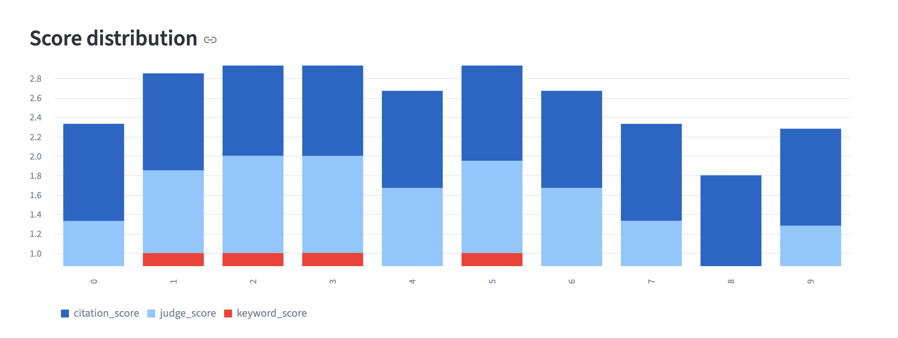

# Document Intelligence Pipeline

## The Problem

Organizations waste thousands of hours manually reading through PDFs — annual reports, contracts, technical manuals, research papers. Keyword search returns too many irrelevant results. Reading entire documents is time-consuming. Existing AI tools send sensitive document content to third-party cloud servers.

## The Solution

A multimodal document intelligence pipeline that:
- Ingests any PDF or Word document automatically
- Extracts text, tables, figures, and scanned pages with full metadata
- Stores content as searchable vector embeddings locally
- Answers plain-English questions with exact page citations and confidence scores
- Runs 100% on-device — no cloud APIs, no data leaves your machine

**Eval results:** Citation accuracy 1.00 · Answer quality 0.91 (LLM-as-judge, 10 golden QA pairs)

**Try it:** Clone the repo, drop a PDF in `data/raw/`, and ask questions via the Streamlit UI or REST API.

**Sample:** See `samples/` for a sample input PDF and the structured JSON output it produces.

---

# Document Intelligence Pipeline

A multimodal document intelligence system that ingests PDFs and Word documents, extracts text, tables, and figures, stores them in a vector database, and answers plain-English questions with page-level citations — running 100% locally with no cloud APIs.

## Demo

Upload a PDF → Ask a question → Get an answer with page citations.

Built as a portfolio project targeting senior ML/AI Engineer roles.

## Architecture

## Screenshots

### Demo — Answer with Confidence Score

### Demo — Confidence Score

### Evaluation Dashboard

### GitHub Repository

